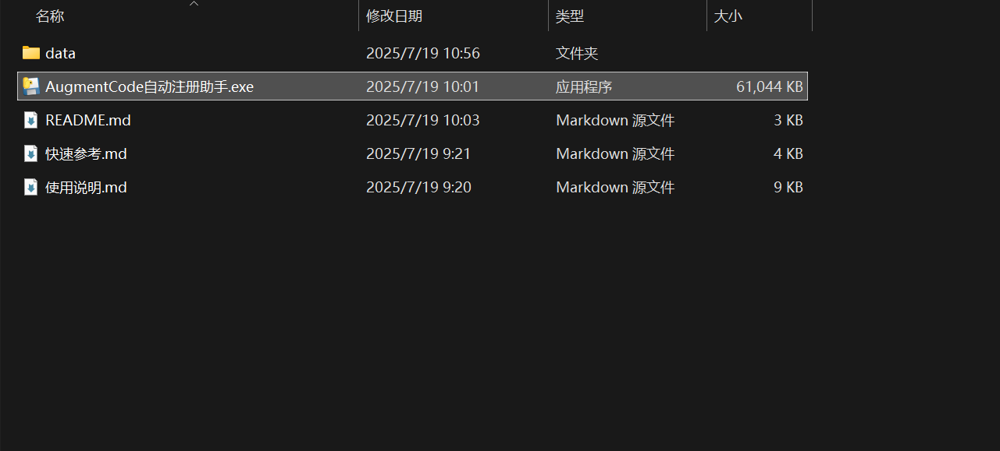
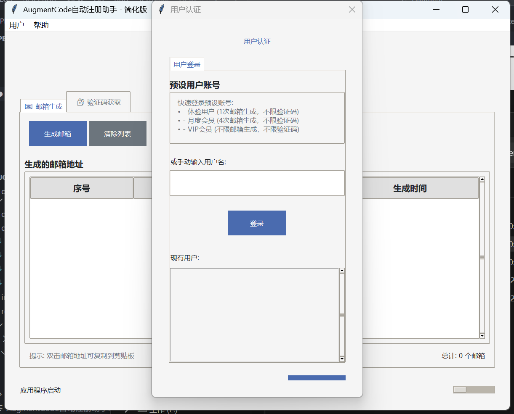
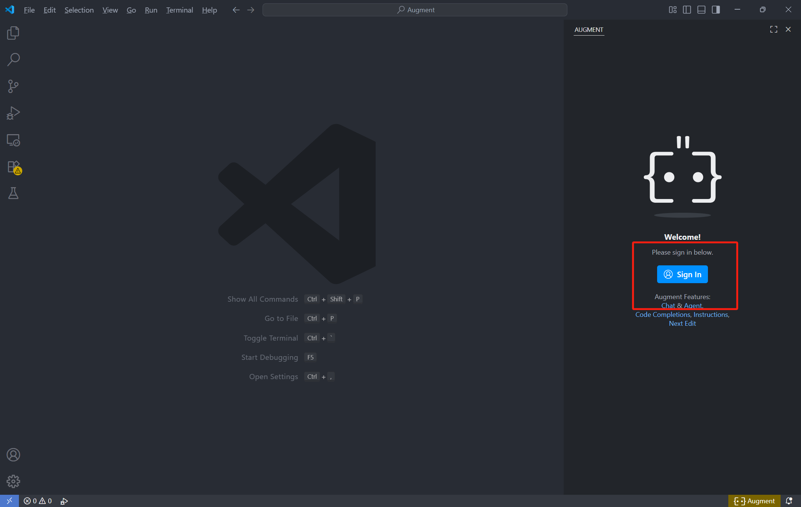
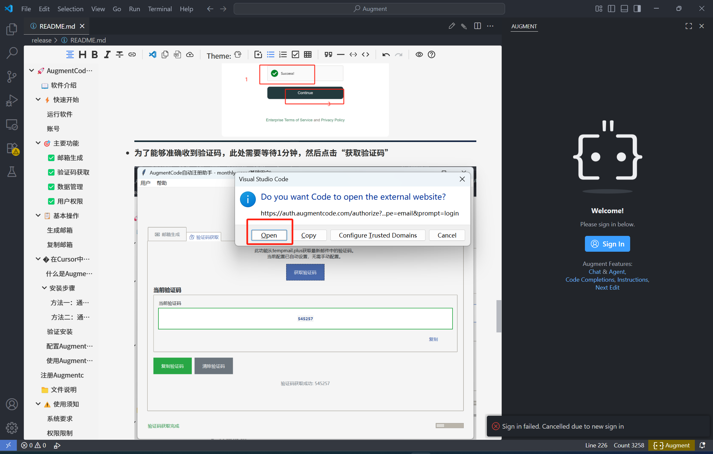
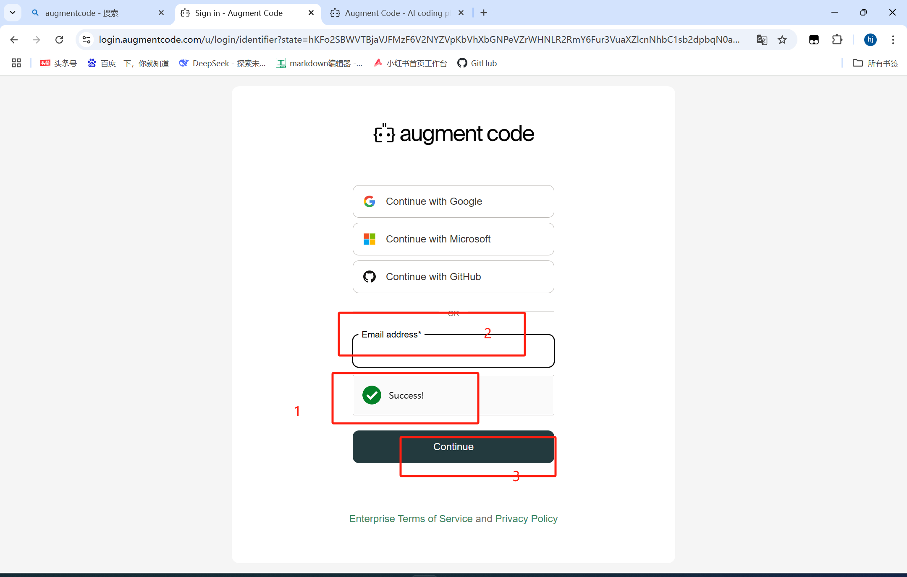
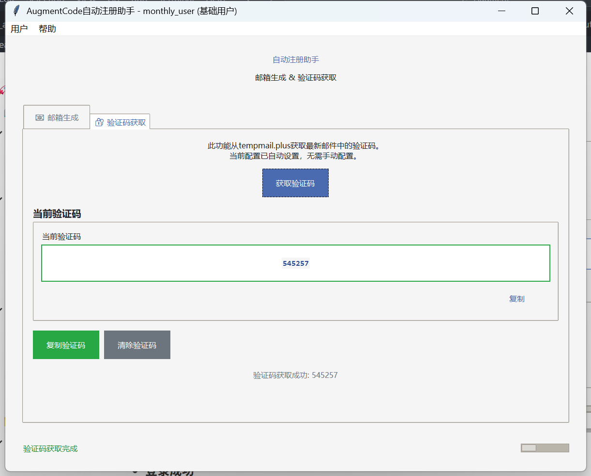
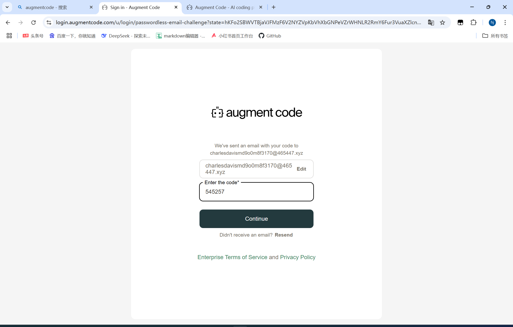
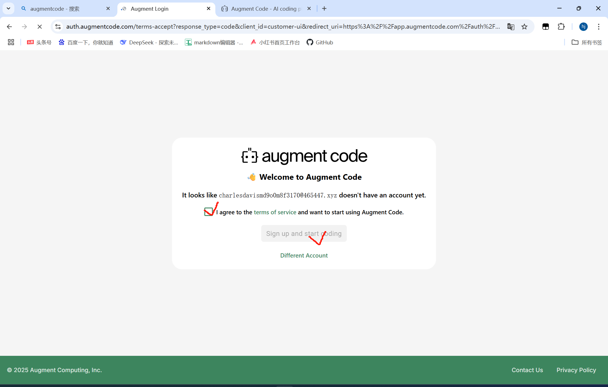
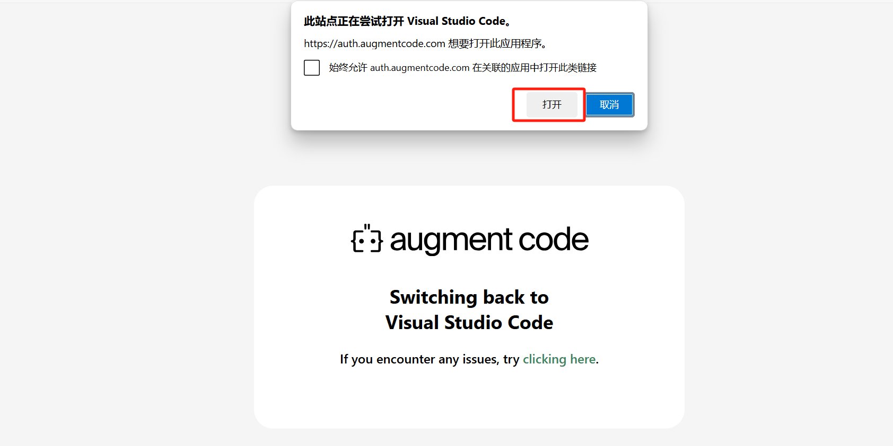
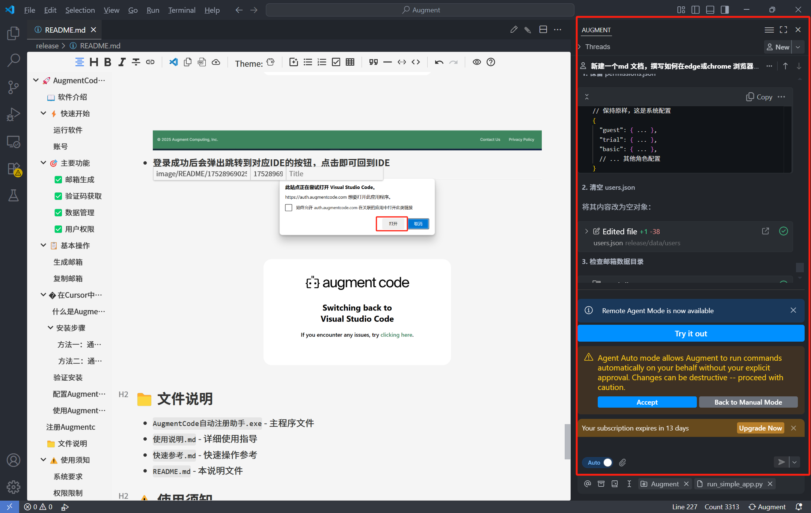

# 🚀 AugmentCode自动注册助手 - 简化版

## 📖 软件介绍

AugmentCode自动注册助手是一个轻量级的临时邮箱生成工具，专为快速生成临时邮箱地址和获取验证码而设计。

## ⚡ 快速开始

### 运行软件

1. 双击 `AugmentCode自动注册助手.exe` 启动程序

   
2. 在弹出的用户认证对话框中选择用户类型

   
3. 开始使用邮箱生成功能

### 账号

- - 体验用户 (1次邮箱生成)
- - 月度会员 (4次邮箱生成)
- - VIP会员 (无限制邮箱生成)

## 🎯 主要功能

### ✅ 邮箱生成

- 自动生成临时邮箱地址
- 邮箱格式：`用户名@465447.xyz`

### ✅ 验证码获取

- 自动获取邮箱验证码
- 支持多种验证码格式
- 实时邮件检查

### ✅ 数据管理

- 邮箱数据自动保存
- 重启后自动恢复
- 按用户隔离存储

### ✅ 用户权限

- 多种用户类型
- 灵活的权限控制
- 操作频率限制

## 📋 基本操作

### 生成邮箱

1. 点击"生成邮箱"按钮
2. 查看生成结果

### 复制邮箱

- **双击邮箱地址** → 自动复制到剪贴板
- **右键菜单** → 选择"复制邮箱"

---

## � 在Cursor中安装Augment插件

### 什么是Augment插件

Augment插件是一个强大的AI代码助手扩展，可以在Cursor编辑器中提供智能代码补全、代码分析和自动化开发功能。

### 安装步骤

#### 方法一：通过VSIX文件安装（推荐）

1. **准备插件文件**

   - 确保您有 `augment.vscode-augment-0.496.2.vsix` 文件
   - 将文件放在容易访问的位置
2. **打开Cursor编辑器**

   - 启动Cursor应用程序
   - 确保编辑器完全加载
3. **安装插件**

   - 按 `Ctrl + Shift + P` (Windows/Linux) 或 `Cmd + Shift + P` (Mac) 打开命令面板
   - 输入 "Extensions: Install from VSIX..."
   - 选择该命令并按回车
4. **选择VSIX文件**

   - 在文件浏览器中导航到 `augment.vscode-augment-0.496.2.vsix` 文件位置
   - 选择文件并点击"安装"
5. **确认安装**

   - 等待安装完成
   - 重启Cursor编辑器以确保插件正常加载

#### 方法二：通过扩展面板安装

1. **打开扩展面板**

   - 点击左侧活动栏中的扩展图标（四个方块图标）
   - 或按 `Ctrl + Shift + X` (Windows/Linux) 或 `Cmd + Shift + X` (Mac)
2. **安装本地扩展**

   - 点击扩展面板右上角的"..."菜单
   - 选择"从VSIX安装..."
   - 浏览并选择 `augment.vscode-augment-0.496.2.vsix` 文件
3. **完成安装**

   - 点击"安装"按钮
   - 等待安装过程完成

### 验证安装

1. **检查扩展列表**

   - 在扩展面板中查看"已安装"部分
   - 确认"Augment"扩展出现在列表中且状态为"已启用"
2. **检查功能**

   - 打开一个代码文件
   - 查看是否有Augment相关的功能和提示
   - 检查状态栏是否显示Augment相关信息

### 配置Augment插件

1. **访问设置**

   - 按 `Ctrl + ,` (Windows/Linux) 或 `Cmd + ,` (Mac) 打开设置
   - 搜索"Augment"查看相关配置选项
2. **基本配置**

   - 设置API密钥（如果需要）
   - 配置代码补全偏好
   - 调整AI助手行为设置
3. **快捷键设置**

   - 按 `Ctrl + K, Ctrl + S` 打开快捷键设置
   - 搜索"Augment"查看和自定义相关快捷键

### 使用Augment功能

1. **AI代码补全**

   - 在编写代码时，Augment会自动提供智能建议
   - 使用 `Tab` 键接受建议
2. **代码分析**

   - Augment会实时分析代码质量
   - 在问题面板中查看建议和警告
3. **AI聊天助手**

   - 使用快捷键或命令面板访问AI聊天功能
   - 询问代码相关问题或请求帮助

---

## 注册Augmentcode

- **打开 IDE（VScode/Curosr) 的Augmentcode 插件**

  
- **点击sign in进入注册页面**
- 
- **点击人机验证Verify，等待验证通过**
- **输入邮箱地址**
- **点击发送验证码**

  
- **为了能够准确收到验证码，此处需要等待1分钟，然后点击“获取验证码”**

  
- **输入收到的验证码，点击continue**

  
- **勾选agree，点击sign up and start coding**

  
- **登录成功后会弹出跳转到对应IDE的按钮，点击即可回到IDE**

  
- 等待IDE  Augment 刷新即可使用

  

## 📁 文件说明

- `AugmentCode自动注册助手.exe` - 主程序文件
- `使用说明.md` - 详细使用指导
- `快速参考.md` - 快速操作参考
- `README.md` - 本说明文件

## ⚠️ 使用须知

### 系统要求

- Windows 10/11 (64位)
- 网络连接 (获取验证码需要)

### 权限限制

- **体验用户**: 总共1次邮箱生成
- **月度会员**: 总共4次邮箱生成
- **VIP会员**: 无限制邮箱生成

## 🔧 故障排除

### 常见问题

- **无法生成邮箱** → 检查权限限制和操作间隔
- **验证码获取失败** → 检查网络连接，稍后重试
- **程序无法启动** → 确保系统满足要求，重新下载

## 📞 技术支持

如遇到问题，请：

1. 查看详细的使用说明文档
2. 检查网络连接状态
3. 重启程序尝试
4. 联系技术支持：小红书 ”爱编程的小羊“

---

**版本**: v1.0
**更新日期**: 2025-07-19
**开发者**: “爱编程的小羊”
**许可证**: MIT License

**感谢使用 AugmentCode自动注册助手！**
